```mermaid
flowchart TD

    %% ═══════════════════════════════════════════════════════
    %% 起點
    %% ═══════════════════════════════════════════════════════
    START(["🟢 開始：荷姆茲海峽軍事對峙<br/>商船遭扣押｜海峽無限期封鎖"])


    %% ═══════════════════════════════════════════════════════
    %% 第一層：情資層 Intelligence
    %% ═══════════════════════════════════════════════════════
    START --> I1

    subgraph L1["🛰️ 情資層：自動偵測與事件收容"]
        direction LR
        I1["📡 爬取地緣政治新聞<br/>crawl_news() 自動掃描"]
        I2["🧠 評估 ESG 風險分數<br/>esg_risk_factors 權重計算"]
        I3[\"📊 建立供應鏈風險事件<br/>supply_chain_events<br/>區域=中東｜impact_days=∞"/]
        I1 --> I2 --> I3
    end


    %% ═══════════════════════════════════════════════════════
    %% 第二層：影響對應層 Impact Mapping
    %% ═══════════════════════════════════════════════════════
    I3 --> B1

    subgraph L2["📐 影響對應層：衝擊範圍量化"]
        direction LR
        B1["🔍 定位受衝擊供應商<br/>中東地區 25 家供應商"]
        B2["📦 盤點受影響採購單<br/>SUP-001 防靜電塑料粒子 3 單"]
        B3["🏭 展開 BOM 產品鏈<br/>塑料粒子 → 電子外殼 → 傳動設備"]
        B4[\"📉 計算庫存可撐天數<br/>150 件 / 日均 5 件 ≈ 30 天"/]
        B1 --> B2 --> B3 --> B4
    end


    %% ═══════════════════════════════════════════════════════
    %% 第二層決策點：是否需要人工介入
    %% ═══════════════════════════════════════════════════════
    B4 --> Q1
    Q1{"庫存是否低於<br/>安全天數？"}
    Q1 -- 否 --> END1(["🔵 結束：庫存尚足<br/>持續監控"])


    %% ═══════════════════════════════════════════════════════
    %% 第三層：決策層 Decision
    %% ═══════════════════════════════════════════════════════
    Q1 -- 是 --> C0

    subgraph L3["🧠 決策層：AI Agent 多智能體協作"]
        direction TB
        C0["🤖 接收自然語言任務<br/>「荷姆茲海峽被封，我們怎麼辦？」"]
        C1["🧭 總管 Orchestrator 語意分析<br/>LLM 意圖分類｜關鍵字路由"]
        C2["⚠️ risk_agent<br/>查詢風險事件"]
        C3["🏭 inventory_agent<br/>查詢庫存現況"]
        C4["📦 procurement_agent<br/>搜尋替代供應商"]
        C5["💰 finance_agent<br/>試算財務衝擊"]
        C6["🌱 carbon_agent<br/>重算碳足跡"]
        C0 --> C1
        C1 --> C2 & C3 & C4 & C5 & C6
    end


    %% ═══════════════════════════════════════════════════════
    %% 第三層決策點：是否需要寫入操作
    %% ═══════════════════════════════════════════════════════
    C2 & C3 & C4 & C5 & C6 --> Q2
    Q2{"Agent 呼叫的<br/>工具是否為寫入操作？"}


    %% ═══════════════════════════════════════════════════════
    %% 第四層：治理層 Governance
    %% ═══════════════════════════════════════════════════════
    Q2 -- 否 / read_only --> G1

    Q2 -- 是 / write --> G2

    subgraph L4["⚖️ 治理層：權限校驗與人工審批"]
        direction TB
        G1["✅ 直接執行唯讀工具<br/>check_inventory / get_suppliers_list"]
        G2["🚪 通過 Tool Gateway 統一入口<br/>gateway.call()｜RBAC 角色權限"]
        G3["⏸️ 建立待審批單<br/>pending_approvals 寫入 DB"]
        G4["👤 推送 Admin Dashboard<br/>管理員登入審批"]
        G5{"Admin 決策：<br/>核准或拒絕？"}
        G1 --> G6
        G2 --> G3 --> G4 --> G5
    end


    %% ═══════════════════════════════════════════════════════
    %% 治理層分支
    %% ═══════════════════════════════════════════════════════
    G5 -- 拒絕 --> G7["🚫 記錄拒絕原因<br/>write_action_log 寫入"]
    G5 -- 核准 --> G6["▶️ 放行執行寫入操作<br/>gateway.approve_action()"]

    G7 --> END2(["🔵 結束：操作已作廢"])


    %% ═══════════════════════════════════════════════════════
    %% 第五層：執行與證據層 Evidence
    %% ═══════════════════════════════════════════════════════
    G1 --> E1
    G6 --> E1

    subgraph L5["🧾 執行與證據層：稽核鏈與可證明監督"]
        direction TB
        E1["🔧 執行工具函式<br/>supplier_replacement｜create_order"]
        E2[\"📝 寫入 agent_action_logs<br/>含 who｜when｜tool｜result"/]
        E3["🔗 計算 Hash Chain<br/>SHA256(prev_checksum + row_data)<br/>transaction 邊界原子寫入"]
        E4["🔍 一鍵驗證稽核鏈<br/>verify_agent_action_logs()"]
        E1 --> E2 --> E3 --> E4
    end

    E4 --> END3(["🟢 結束：稽核鏈完整<br/>valid=True｜tampered=[]"])

    %% ═══════════════════════════════════════════════════════
    %% 樣式
    %% ═══════════════════════════════════════════════════════
    classDef startEnd fill:#e8f5e9,stroke:#2e7d32,stroke-width:2px,color:#1b5e20
    classDef process fill:#e3f2fd,stroke:#1565c0,stroke-width:1px,color:#0d47a1
    classDef decision fill:#fff3e0,stroke:#ef6c00,stroke-width:2px,color:#e65100
    classDef io fill:#f3e5f5,stroke:#7b1fa2,stroke-width:1px,color:#4a148c
    classDef layer1 fill:#ffebee,stroke:#c62828,stroke-width:2px
    classDef layer2 fill:#fff8e1,stroke:#f9a825,stroke-width:2px
    classDef layer3 fill:#e8eaf6,stroke:#3949ab,stroke-width:2px
    classDef layer4 fill:#e0f2f1,stroke:#00695c,stroke-width:2px
    classDef layer5 fill:#fce4ec,stroke:#ad1457,stroke-width:2px

    class START,END1,END2,END3 startEnd
    class I1,I2,B1,B2,B3,C0,C1,C2,C3,C4,C5,C6,G1,G2,G3,G4,G6,G7,E1,E3,E4 process
    class Q1,Q2,G5 decision
    class I3,B4,E2 io
```

---

## 情境走讀：荷姆茲海峽衝突 → A 公司的 15 分鐘

| 時間軸 | 層 | 發生什麼 | 對應模組 |
|--------|-----|----------|----------|
| **T+0** | 情資層 | 系統 `crawl_news()` 爬取到中東地緣衝突新聞 → 自動建立一筆 `supply_chain_events`（區域=中東, impact_days=∞, 風險分數=95） | `ai_supply_chain.py` |
| **T+2m** | 影響對應層 | `get_supply_chain_risk_events()` 查出中東地區 25 家供應商，`get_impacted_purchase_orders()` 標出「SUP-001 防靜電塑料粒子」未到貨 3 張採購單 | `ai_supply_chain.py` |
| **T+4m** | 影響對應層 | 透過 BOM 展開：該原料影響產品 P005（電子外殼）→ 往上影響 P001（傳動設備），庫存僅剩 150 件，日均銷量 5 件 ≈ 30 天 | `manufacturing.py` / `inventory.py` |
| **T+6m** | 決策層 | 老闆輸入「荷姆茲海峽被封，我們怎麼辦？」→ Orchestrator 語意分析 → 建立 Agent 鏈：`risk_agent → inventory_agent → procurement_agent → finance_agent` | `agent_orchestrator.py` |
| **T+8m** | 決策層 | `risk_agent` 呼叫 `get_supply_chain_risk_events` → `inventory_agent` 呼叫 `get_low_stock_inventory` → `procurement_agent` 呼叫 `get_suppliers_list`（找非中東替代商） | 各 agent + `tool_registry` |
| **T+10m** | 治理層 | `procurement_agent` 呼叫 `supplier_replacement` 要切換供應商 → risk_level=write → **Gateway 攔截** → 建立 `pending_approvals` → 推送 Admin Dashboard | `tool_gateway.py` |
| **T+12m** | 治理層 | Admin 登入 Dashboard，看到待審批「替換供應商 SUP-001 → SUP-020（越南）」→ 點擊✅核准 | `page_agent_dashboard.py` |
| **T+13m** | 執行層 | Gateway 放行 → `supplier_replacement` 執行 → 寫入 `supplier_replacement_logs` + `agent_action_logs`（含 hash chain） | `agent_logger.py` |
| **T+14m** | 證據層 | 庫存 agent 建議立即下採購單補貨 → 另送審批 → 核准 → 執行 | 同上 |
| **T+15m** | 證據層 | 老闆點「驗證稽核鏈」→ `verify_agent_action_logs()` → `{"valid": True, "tampered_rows": [], "legacy_rows": 0}` ✅ | `log_checksum.py` |

---

## 情境走讀：荷姆茲海峽衝突 → A 公司的 15 分鐘

| 時間軸 | 層 | 發生什麼 | 對應模組 |
|--------|-----|----------|----------|
| **T+0** | 情資層 | 系統 `crawl_news()` 爬取到中東地緣衝突新聞 → 自動建立一筆 `supply_chain_events`（區域=中東, impact_days=∞, 風險分數=95） | `ai_supply_chain.py` |
| **T+2m** | 影響對應層 | `get_supply_chain_risk_events()` 查出中東地區 25 家供應商，`get_impacted_purchase_orders()` 標出「SUP-001 防靜電塑料粒子」未到貨 3 張採購單 | `ai_supply_chain.py` |
| **T+4m** | 影響對應層 | 透過 BOM 展開：該原料影響產品 P005（電子外殼）→ 往上影響 P001（傳動設備），庫存僅剩 150 件，日均銷量 5 件 ≈ 30 天 | `manufacturing.py` / `inventory.py` |
| **T+6m** | 決策層 | 老闆輸入「荷姆茲海峽被封，我們怎麼辦？」→ Orchestrator 語意分析 → 建立 Agent 鏈：`risk_agent → inventory_agent → procurement_agent → finance_agent` | `agent_orchestrator.py` |
| **T+8m** | 決策層 | `risk_agent` 呼叫 `get_supply_chain_risk_events` → `inventory_agent` 呼叫 `get_low_stock_inventory` → `procurement_agent` 呼叫 `get_suppliers_list`（找非中東替代商） | 各 agent + `tool_registry` |
| **T+10m** | 治理層 | `procurement_agent` 呼叫 `supplier_replacement` 要切換供應商 → risk_level=write → **Gateway 攔截** → 建立 `pending_approvals` → 推送 Admin Dashboard | `tool_gateway.py` |
| **T+12m** | 治理層 | Admin 登入 Dashboard，看到待審批「替換供應商 SUP-001 → SUP-020（越南）」→ 點擊✅核准 | `page_agent_dashboard.py` |
| **T+13m** | 執行層 | Gateway 放行 → `supplier_replacement` 執行 → 寫入 `supplier_replacement_logs` + `agent_action_logs`（含 hash chain） | `agent_logger.py` |
| **T+14m** | 證據層 | 庫存 agent 建議立即下採購單補貨 → 另送審批 → 核准 → 執行 | 同上 |
| **T+15m** | 證據層 | 老闆點「驗證稽核鏈」→ `verify_agent_action_logs()` → `{"valid": True, "tampered_rows": [], "legacy_rows": 0}` ✅ | `log_checksum.py` |
